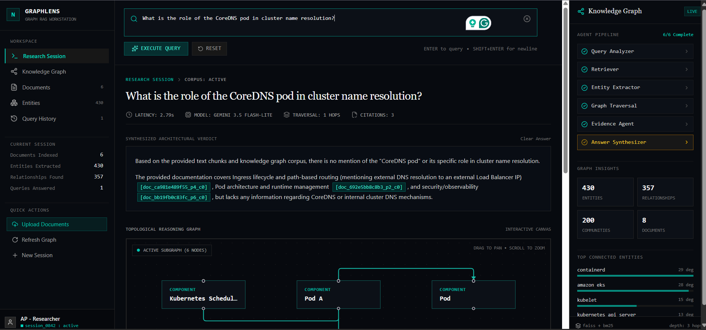
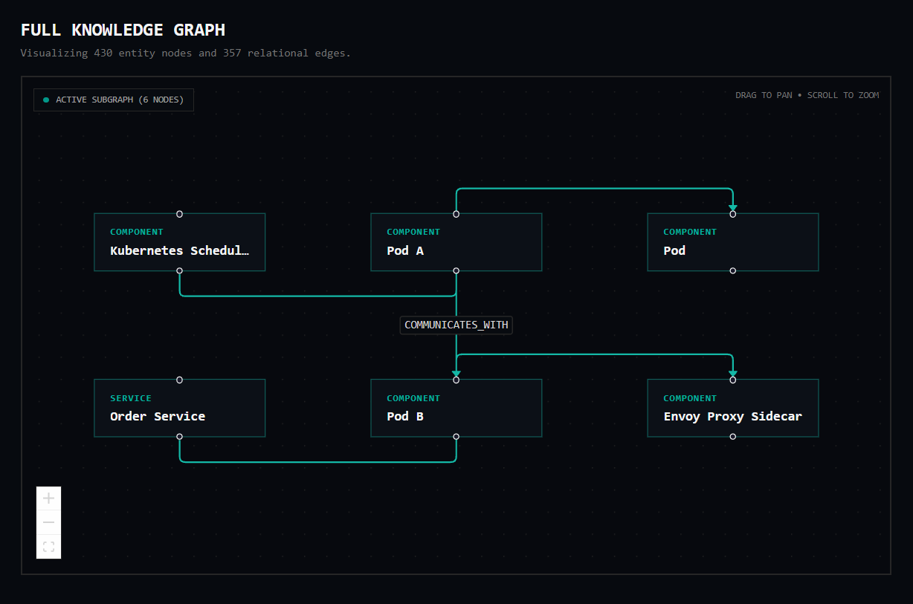
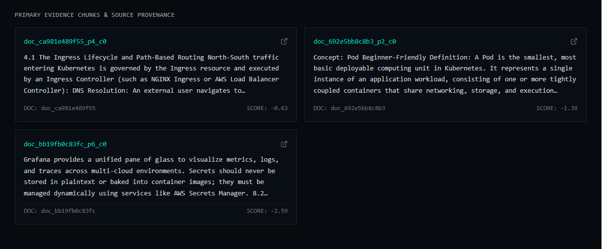
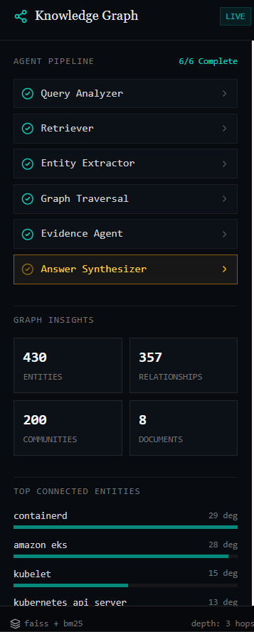
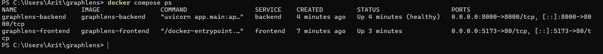

# GraphLens 🔍🕸️

**GraphLens** is a **Hybrid Graph RAG** system for researching technical documentation. It combines **BM25 lexical retrieval, dense vector retrieval, Reciprocal Rank Fusion (RRF), cross-encoder reranking, and multi-hop knowledge-graph traversal** to produce grounded answers backed by source evidence.

## Overview

GraphLens goes beyond traditional RAG by combining multiple retrieval strategies with a structured knowledge graph.

Instead of relying only on semantic similarity, GraphLens:

- Retrieves relevant passages using **BM25 + dense vector search**
- Combines retrieval results using **Reciprocal Rank Fusion (RRF)**
- Reranks candidates using a **local cross-encoder**
- Extracts and normalizes important entities and relationships
- Builds a controlled **NetworkX knowledge graph**
- Performs bounded **multi-hop graph traversal**
- Assembles evidence with document and page provenance
- Uses **Gemini** to synthesize the final grounded answer

### Retrieval Pipeline

    PDF Documents
          ↓
    Text Extraction
          ↓
    Page-Aware Semantic Chunking
          ↓
     ┌───────────────┬────────────────┐
     │ BM25 Retrieval │ Dense Retrieval│
     └───────┬───────┴───────┬────────┘
             └───────┬───────┘
                     ↓
            Reciprocal Rank Fusion
                     ↓
                 Reranking
                     ↓
          Entity & Relationship Extraction
                     ↓
              Knowledge Graph
                     ↓
           Bounded Multi-Hop Traversal
                     ↓
           Evidence + Provenance
                     ↓
              Gemini Synthesis
                     ↓
              Grounded Answer

## Key Features

- **Hybrid RAG** — BM25 + FAISS dense retrieval
- **RRF Fusion** — combines lexical and semantic retrieval results
- **Cross-Encoder Reranking** — improves relevance of retrieved evidence
- **Knowledge Graph** — structured entities and relationships using NetworkX
- **Entity Normalization** — reduces duplicate or inconsistent entity representations
- **Multi-Hop Retrieval** — follows bounded relationships across the graph
- **Evidence Grounding** — answers are tied to retrieved document evidence
- **Page-Level Provenance** — preserves document and page information
- **Local Retrieval Stack** — minimizes unnecessary LLM/API calls
- **Gemini Model Routing** — Gemini 3.5 Flash-Lite as primary with Gemini 3.7 Flash fallback
- **Retrieval Evaluation** — compares BM25, dense, hybrid, and reranked retrieval

## Screenshots

### 1. GraphLens Overview

### 2. Subgraph Reasoning Canvas

### 3. Evidence & Provenance Cards

### 4. Agent Pipeline Metrics

### 5. Docker Deployment

## UI

GraphLens uses a dedicated research workstation interface rather than a generic chatbot layout.

- **Research Session** — spacious query workspace, grounded answer, reasoning path, and evidence
- **Knowledge Graph** — interactive node and edge visualization
- **Documents** — indexed document exploration and previews
- **Entities** — searchable entities and relationships
- **Query History** — previous research queries and results
- **Agent Pipeline** — visible retrieval and reasoning stages
- **Graph Insights** — connected entities, graph statistics, and traversal information

The graph visualization uses **React Flow** with **ELK.js** for automatic graph layout.

## Architecture

GraphLens separates document ingestion, retrieval, graph processing, evidence assembly, and answer synthesis into distinct stages.

### Document Ingestion

- PDF extraction
- Page-aware text processing
- Semantic chunking
- Document and page metadata preservation
- Local embedding generation
- BM25 index construction
- FAISS vector index construction

### Hybrid Retrieval

GraphLens performs two complementary retrieval operations:

- **BM25** for exact terminology, keywords, identifiers, and technical phrases
- **Dense retrieval** for semantic similarity and concept-level matching

The two result sets are combined using **Reciprocal Rank Fusion (RRF)**.

### Reranking

The fused candidates are passed through a local cross-encoder reranker to improve the ordering of the most relevant evidence before graph traversal and synthesis.

### Knowledge Graph

GraphLens extracts entities and relationships from the document corpus and constructs a controlled NetworkX graph.

The graph preserves relationships such as:

- technology → uses → component
- service → depends on → service
- component → communicates with → component
- technology → provides → capability
- service → requires → permission
- component → connects to → network resource

Entities are normalized before graph construction to reduce duplicate representations.

### Multi-Hop Retrieval

Relevant graph nodes are used as traversal starting points.

GraphLens performs **bounded multi-hop traversal** to discover related entities and supporting evidence without allowing uncontrolled graph expansion.

### Evidence & Synthesis

Retrieved chunks and graph-derived relationships are assembled into an evidence package containing document and page provenance.

Gemini then synthesizes the final answer from the retrieved evidence.

## Tech Stack

### Frontend

- React 19
- TypeScript
- Vite
- Tailwind CSS
- React Flow
- ELK.js
- Lucide Icons

### Backend

- Python 3.11+
- FastAPI
- Pydantic
- Uvicorn

### RAG & AI

- Google Gemini API
- `google-genai`
- FAISS
- Rank-BM25
- Sentence Transformers
- Cross-Encoder Reranking
- NetworkX

### Infrastructure

- Docker
- Docker Compose
- Nginx

## 📁 Project Structure

    graphlens/
    ├── app/
    │   ├── api/
    │   │   ├── routes.py
    │   │   └── schemas.py
    │   │
    │   ├── config/
    │   │   └── settings.py
    │   │
    │   ├── evidence/
    │   │   ├── assembler.py
    │   │   └── schemas.py
    │   │
    │   ├── graph/
    │   │   ├── batch_pipeline.py
    │   │   ├── knowledge_graph.py
    │   │   ├── schemas.py
    │   │   └── traversal.py
    │   │
    │   ├── ingestion/
    │   │   ├── chunker.py
    │   │   ├── extractor.py
    │   │   ├── pipeline.py
    │   │   └── schemas.py
    │   │
    │   ├── rerank/
    │   │   └── cross_encoder.py
    │   │
    │   ├── retrieval/
    │   │   ├── bm25_index.py
    │   │   ├── faiss_index.py
    │   │   └── hybrid_rrf.py
    │   │
    │   ├── synthesis/
    │   │   ├── prompts.py
    │   │   └── synthesizer.py
    │   │
    │   ├── cli.py
    │   ├── main.py
    │   └── pipeline.py
    │
    ├── assets/
    │   ├── graphlens-overview.png
    │   ├── subgraph-reasoning-canvas.png
    │   ├── evidence-provenance-cards.png
    │   ├── agent-pipeline-metrics.png
    │   └── docker-deployment.png
    │
    ├── backend/
    │   ├── .dockerignore
    │   └── Dockerfile
    │
    ├── data/
    │   ├── cache/
    │   ├── indices/
    │   ├── raw_pdfs/
    │   ├── sample/
    │   └── knowledge_graph.json
    │
    ├── frontend/
    │   ├── public/
    │   └── src/
    │       ├── assets/
    │       ├── components/
    │       ├── api.ts
    │       ├── App.css
    │       ├── App.tsx
    │       ├── index.css
    │       ├── main.tsx
    │       └── types.ts
    │   ├── .dockerignore
    │   ├── Dockerfile
    │   ├── eslint.config.js
    │   ├── index.html
    │   ├── nginx.conf
    │   ├── package.json
    │   ├── package-lock.json
    │   ├── tsconfig.app.json
    │   ├── tsconfig.json
    │   ├── tsconfig.node.json
    │   └── vite.config.ts
    │
    ├── tests/
    │   └── unit/
    │       ├── test_api.py
    │       ├── test_evidence.py
    │       ├── test_graph_extractor.py
    │       ├── test_knowledge_graph.py
    │       ├── test_pipeline.py
    │       ├── test_retrieval.py
    │       ├── test_synthesis.py
    │       └── test_traversal.py
    │
    ├── .dockerignore
    ├── .env.example
    ├── .gitignore
    ├── docker-compose.yml
    ├── pyproject.toml
    ├── README.md
    └── requirements.txt

## Quick Start

### 1. Clone

    git clone <repository-url>
    cd graphlens

### 2. Configure Environment

Create a `.env` file from `.env.example` and configure the Gemini API key and application settings.

### 3. Run with Docker

    docker compose up --build

### Local Development

Backend:

    cd backend
    pip install -r requirements.txt
    uvicorn app.main:app --reload

Frontend:

    cd frontend
    npm install
    npm run dev

## Testing

Run the backend test suite with:

    pytest

GraphLens also evaluates retrieval quality across multiple retrieval strategies:

    BM25
    Dense Retrieval
    Hybrid RRF
    Hybrid + Reranking

Evaluation can use metrics such as **Precision@K** and **NDCG@K** to compare retrieval performance.

## Security

- API keys are stored through environment variables
- Secrets are excluded from source control
- Uploaded documents are processed locally
- File-processing boundaries are validated
- Graph traversal is bounded to prevent uncontrolled expansion
- Retrieval is constrained to indexed evidence
- LLM responses are grounded against retrieved context
- External model calls are minimized through local retrieval and caching

## License

This project is licensed under the MIT License.
